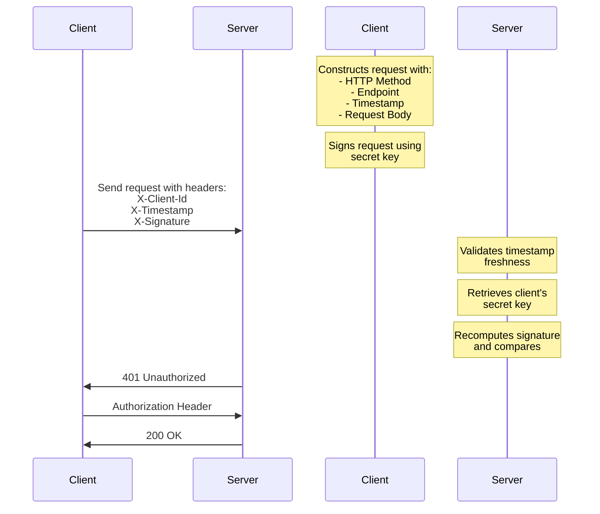

# API Request Signing
This project demonstrates a secure API authentication mechanism using Request Signatures implemented in C#.
Instead of sending API keys directly in the request, this approach uses cryptographic signatures to verify request authenticity.

## Why is this important?
Request signing provides several security advantages over simple API keys:
1. **Non-repudiation**: The server can prove that a request was made by a specific client.
2. **Request Integrity**: The server can verify that the request has not been tampered with in transit.
3. **No Secret Transmission**: The client does not need to send the secret key in the request. 
4. **Replay Protection**: Time-bound requests prevent replay attacks.

### Request Flow


### Project Structure
```text
├── RequestSigning.Server/      # API server implementation
├── RequestSigning.Client/      # Demo client implementation
└── RequestSigning.Common/      # Shared models and utilities
```

### Running the Demo
1. Clone the repository
2. Start the server: `cd RequestSigning.Server && dotnet run`
3. In a new terminal, start the client: `cd RequestSigning.Client && dotnet run`


Good Luck!